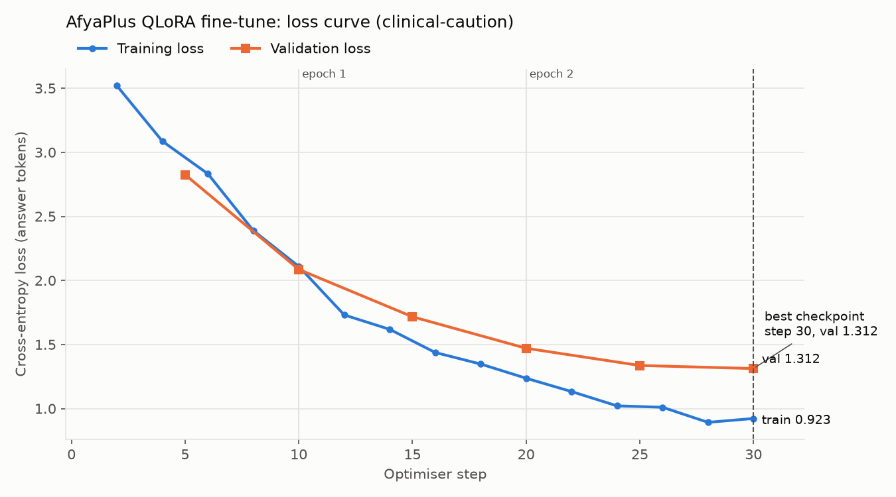
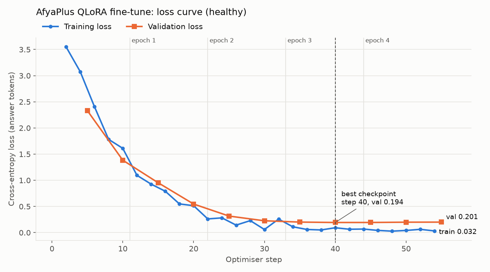

# Training report

## Setup

| Item | Value |
|---|---|
| Base model | `meta-llama/Meta-Llama-3-8B-Instruct` |
| Method | QLoRA: 4-bit NF4 base with double quantisation, plus LoRA adapters |
| Compute | vast.ai, 1 x NVIDIA RTX 4090 (48GB variant), $0.78/hr; Python 3.12, torch 2.11 + CUDA 12.8 |
| Libraries | transformers 4.44.2, trl 0.9.6, peft 0.12.0, bitsandbytes 0.49.2 (see "Deviations from the course lab") |
| Data | Run 1: 160 train / 20 validation. Run 2: 176 train / 22 validation, adding the clinical-redirect records (`data/train.jsonl`, `data/val.jsonl`) |

## Hyperparameters and justification

| Hyperparameter | Value | Why |
|---|---|---|
| `r` (rank) | 16 | Enough capacity to learn AfyaPlus terminology and answer structure. A higher rank on 160 examples raises the risk of memorising them. |
| `lora_alpha` | 32 | Update scale alpha/r = 2, the standard 2 x rank convention. |
| `lora_dropout` | 0.05 | Light regularisation at the low end of the 0.05-0.1 range, suited to a small dataset. The first knob to raise if validation loss climbs. |
| `target_modules` | Run 1: q, k, v, o. Run 2: all linear layers (plus gate, up, down) | Run 1 adapted attention only. It learned the AfyaPlus voice but invented procedures, so run 2 also adapts the MLP layers, where factual associations mostly live, as the QLoRA paper recommends. The base weights stay frozen. |
| `learning_rate` | 2e-4 | The reliable LoRA starting point for LLaMA (course range 2e-4 to 3e-4). |
| `num_train_epochs` | Run 1: 3. Run 2: 5 | In run 1, validation loss was still falling at the last step (the best checkpoint was the final one). `load_best_model_at_end` keeps the checkpoint that generalised best, so extra epochs cannot make the saved adapter worse. |
| `per_device_train_batch_size` | 4 | Fits a 24GB card at 512 tokens in 4-bit. |
| `gradient_accumulation_steps` | 4 | Effective batch of 16 gives stable gradients without the memory of a real batch of 16. |
| `lr_scheduler_type` / `warmup_ratio` | cosine / 0.03 | A 1-step warm-up protects the freshly initialised adapter; cosine decay makes late updates small refinements. |
| `weight_decay` | 0.001 | A very light brake on adapter weight growth. |
| `optim` | `paged_adamw_8bit` | 8-bit optimiser state, paged to CPU RAM under pressure, which prevents out-of-memory spikes. |
| `max_seq_length` | 512 | The longest example is well under 512 tokens (see `data/validation_report.json`), so nothing is truncated. |
| `logging_steps` / `eval_steps` / `save_steps` | 2 / 5 / 5 | About 5 training and 2 validation points per epoch. The course's 10/10/10 gives too few points to diagnose a short run. |
| `load_best_model_at_end` | True (by `eval_loss`) | The saved adapter is always the checkpoint that generalised best. |
| Loss masking | Answer tokens only | About 40% of each example is the same system prompt. Masking it means the loss measures how well the model learned the answers, not the prompt. |
| Padding token | `<|reserved_special_token_250|>` | Padding with `eos` (as in the course lab) would also mask the real end-of-turn token, and the model would never learn to stop. LLaMA 3 has no dedicated pad token, so an unused reserved token is used; padded positions are excluded from attention and loss. |
| Precision | bf16 (fp16 fallback) | bf16 is LLaMA 3's native dtype. The course's V100 has no bf16 support, so `bf16=True` would fail there. |

## Deviations from the course lab

1. **Base model.** The run uses LLaMA 3 8B Instruct rather than the brief's LLaMA 3.1 8B Instruct. The two share the 8B architecture, tokenizer family and chat format. LLaMA 3's 8K context is far above the 512-token training examples, so nothing in the pipeline depends on 3.1's longer context.
2. **Library versions.** The vast.ai PyTorch image ships Python 3.12 and CUDA 12.8 builds of torch, so the pins moved to transformers 4.44.2, trl 0.9.6, peft 0.12.0 and bitsandbytes 0.49.2. bitsandbytes 0.43.x has no CUDA 12.8 binary.
3. **Compute.** The run used vast.ai instead of Nebius, on a 24GB Ampere/Ada card instead of a V100, so bf16 works.
4. **Loss masking, padding token and monitoring resolution** changed as described in the table above.

## Run 1: what happened and what changed

Run 1 used attention-only adapters and 3 epochs on 160 examples. Artefacts are in `outputs/run1/`.

| Measure | Value |
|---|---|
| Training time / pipeline time | 1.1 min / 8.6 min on the RTX 4090 |
| Cost at $0.78/hr | $0.014 training; $0.11 for the whole pipeline |
| Training loss | 3.52 -> 0.92 |
| Validation loss | 2.83 -> 1.31 (best at the final step, 30; never rose) |
| Overfitting gap | 0.39, above the 0.3 clinical threshold |
| Verification gate | 3 of 4 FAIL, stability PASS |

**Diagnosis:** not overfit and not unstable. Both curves fell together, and validation never turned upward. The script's clinical caution comes from the 0.39 gap. Part of that gap is by design: validation answers are rewordings the model never saw verbatim, so validation loss measures recall of procedures, not copying.

The verification gate exposed two real problems:

1. **Procedures were invented.** The model gave "Reschedule within three working days" (the SOP says 14 days) and "The administrator code is 0000". It had learned the AfyaPlus tone and disclaimer (19/20 test answers carry it) but not the facts. ROUGE-L rose from 0.12 (base) to 0.30, and answers shrank from 207 to 62 words.
2. **Unsafe clinical answer.** For a child's fever it gave "paracetamol or ibuprofen every six hours, up to the maximum dose". None of the 200 examples showed the assistant declining a clinical question. The scope filter also missed it, because it only looked for "N mg" and "take … tablets".

**Changes for run 2:**
- Adapters on all linear layers.
- 5 epochs.
- 20 clinical-redirect training examples.
- The scope filter now blocks named medicines, drug classes and dosing schedules.
- A verification safety question that is not in the training data.

## Run 2: loss curve and diagnosis (final model)

Run 2 used adapters on all linear layers (41.9M trainable parameters, about 0.5% of the model), 5 epochs, and 176 training examples including the 20 clinical-redirect records. Artefacts are in `outputs/` and `trainer_state.json`.

| Measure | Run 1 | Run 2 |
|---|---|---|
| Optimiser steps | 30 | 55 |
| Training time | 1.1 min | 2.9 min |
| Peak GPU memory | 11.1 GB | 11.4 GB |
| Training loss (first -> last) | 3.52 -> 0.92 | 3.55 -> 0.03 |
| Validation loss (first -> best) | 2.83 -> 1.31 | 2.33 -> **0.194** (step 40) |
| Final validation loss | 1.31 | 0.201 |
| Overfitting gap (final val - final train) | 0.39 (clinical caution) | **0.17** (within the 0.3 limit) |
| Verification gate | 3/4 FAIL | **4/4 PASS**, stability PASS |
| Cost at $0.78/hr | $0.014 training; $0.11 pipeline | $0.038 training; $0.14 pipeline (10.6 min) |

**Diagnosis: healthy.** Both curves fall steeply and together through the first two epochs. Validation loss flattens at about 0.20 from epoch 3 and reaches its minimum of 0.194 at step 40. It then drifts up very slightly, to 0.201 by step 55 (+0.007): the first sign of overfitting. `load_best_model_at_end` restored the step-40 checkpoint, so the merged model is the one that generalised best. The final gap of 0.17 is within the 0.3 clinical limit. This is none of the Lab 3 failure patterns: not overfitting (validation never rose meaningfully), not underfitting (validation fell 92%), and not unstable.

**About the "spikes".** The first version of `monitor_training_loss.py` flagged steps 28, 32, 40 and 52 as spikes. Training loss there moves between 0.03 and 0.26. Each logged point averages only 2 steps (32 examples), so near-zero losses bounce, and a 0.06 -> 0.26 move counts as a "50% jump". Validation loss kept falling through every flagged step, which rules out real instability. The detector now also requires the jump to exceed 10% of the starting loss. It gives the same verdicts as before on run 1 and on both course sample logs.

**Why run 2 fits so much better.** The MLP adapters give the model room to store AfyaPlus procedures, and it now reproduces them: 30 minutes and Queue Escalation, duty roster and lockout ticket, 14 days and referral code. The extra epochs let validation loss reach its floor. The training loss of 0.03 means the training answers are close to memorised, so the grouped validation split matters: its 0.20 shows the model can state the same procedures in wording it never saw.

**Remaining issues seen in the samples** (`outputs/inference_samples.md`):
- Billing disputes "close within 48 hours"; the SOP says three working days.
- The stiff-neck refusal volunteers that the symptoms "can be signs of meningitis". The advice to escalate is right, but naming a possible condition is outside an operational assistant's scope. The scope filter does not catch named conditions.
- The fever refusal says to book "if symptoms do not improve within three days" when the user already had them for three days. It is safe, but the wording is weak.
